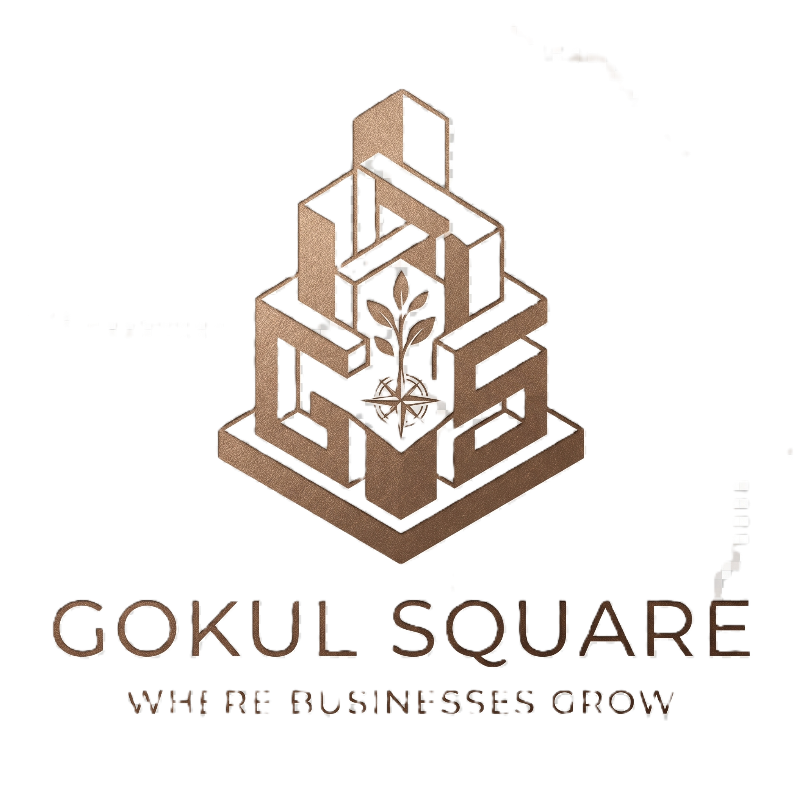

<div align="center">
  
  <h1>Gokul Square 🏢✨</h1>
  <p><em>Where Businesses Grow — Toranagallu's Premium Commercial Destination</em></p>
  
  
  
  
  
  
</div>

<br />

## 🎯 Vision & Motive
Gokul Square is a premium commercial complex that blends high-end retail shopping, a stunning rooftop dining experience, and boutique luxury lodging. 

The motive of this website is to provide an ultra-premium, "Minimal Luxury" digital storefront that matches the physical elegance of the property. It is designed to wow visitors with cinematic visuals and smooth micro-animations, allowing them to seamlessly explore the property and make bookings.

## ✨ Core Features
- **🏢 Interactive Space Explorer:** Navigate the various floors and premium retail/office spaces with real-time availability status.
- **🛏️ Luxury Lodging Booking:** Request reservations for premium rooms and suites seamlessly with a modern UI.
- **🍽️ Rooftop Dining Reservations:** Book a table at the panoramic rooftop restaurant with an interactive curated menu.
- **⚡ Performance Optimized:** Images are automatically scaled, compressed to WebP, and served via Cloudinary global CDN to ensure lightning-fast mobile performance.
- **🛠️ Unified Admin Dashboard:** A sleek "Central Reception Dashboard" for staff to manage both dining and lodging requests efficiently.

## 🛠️ Technology Stack
This project is built using modern, state-of-the-art web technologies focusing on performance and aesthetics:
- **[Next.js (React)](https://nextjs.org/):** The core framework used for fast, server-rendered React applications and seamless routing.
- **[Tailwind CSS](https://tailwindcss.com/):** Used for all styling, allowing for a pixel-perfect "Minimal Luxury" aesthetic (utilizing signature Warm Orange, Soft Gold, and Charcoal colors).
- **[Framer Motion](https://www.framer.com/motion/):** Powers the cinematic entrance effects, smooth scrolling transitions, and interactive hover micro-animations.
- **[Cloudinary](https://cloudinary.com/):** Cloud media delivery network used to optimize and serve all heavy imagery.
- **[Lucide React](https://lucide.dev/):** Provides the clean, premium iconography used throughout the dashboards and landing pages.

---

## 🚀 Getting Started

Follow these detailed instructions to run the Gokul Square website on your local machine.

### Prerequisites
Make sure you have **Node.js** installed on your computer. You can download it from [nodejs.org](https://nodejs.org/).

### 1. Clone & Open the Project
Open your terminal (or command prompt) and navigate to the project directory:
```bash
cd "gokul square"
```

### 2. Install Dependencies
Install all required packages and libraries by running:
```bash
npm install
```

### 3. Start the Development Server
Start the local server with Hot Module Replacement (HMR):
```bash
npm run dev
```

### 4. Build for Production (Recommended for testing performance)
To test the true speed and optimizations (especially on mobile), build the production version:
```bash
npm run build
npm run start
```

Open your web browser and go to:
**[http://localhost:3000](http://localhost:3000)**

---

## 📁 Project Structure

```text
📦 src
 ┣ 📂 app               # Next.js App Router (Pages & Layouts)
 ┃ ┣ 📂 lodging         # Luxury Lodging section
 ┃ ┣ 📂 restaurant      # Dining & Rooftop section
 ┃ ┣ 📂 spaces          # Commercial space listings
 ┃ ┗ 📜 layout.tsx      # Root layout
 ┣ 📂 components        # Reusable UI Components
 ┃ ┣ 📂 home            # Landing page components
 ┃ ┣ 📂 layout          # Navbar, Footer, etc.
 ┃ ┣ 📂 lodging         # Lodging specific components
 ┃ ┗ 📂 rooftop         # Restaurant specific components
 ┣ 📂 data              # Static mock data (Spaces, Menus, etc.)
 ┗ 📜 globals.css       # Tailwind configuration and custom CSS
```

## 📍 Key Routes
- **Home Landing:** `/`
- **Commercial Spaces:** `/spaces`
- **Luxury Lodging:** `/lodging`
- **Rooftop Dining:** `/restaurant`
- **Central Reception Dashboard:** `/rooftop/reception` or `/lodging/reception`

## ☁️ Media Management
All heavy images have been migrated from local storage to **Cloudinary** to ensure the GitHub repository remains lightweight and mobile users receive compressed images.
To update room images, upload them directly to the `spaces` folder in your Cloudinary Media Library, and the app will automatically fetch them!

<div align="center">
  <br />
  <p>Designed and optimized with ❤️ for <b>Gokul Square</b></p>
</div>
